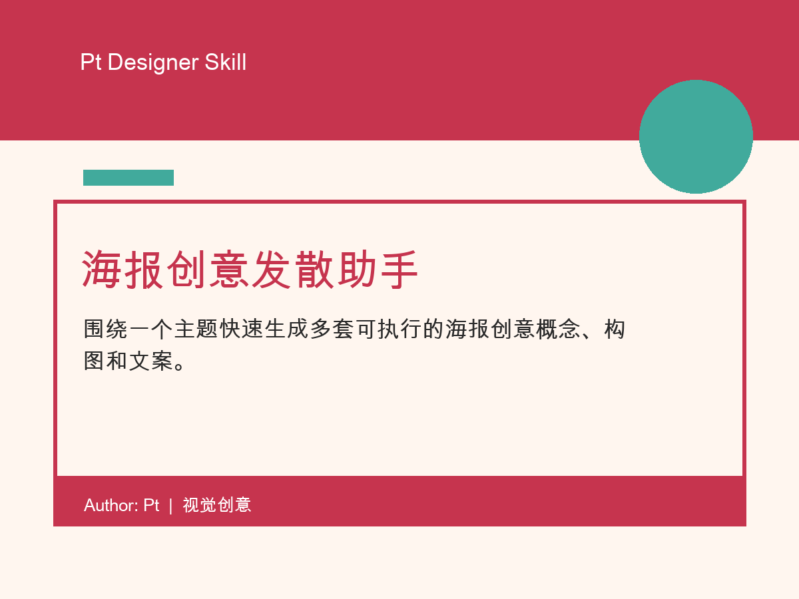

# 海报创意发散助手

围绕一个主题快速生成多套可执行的海报创意概念、构图和文案。

## 适合谁

视觉设计师、运营设计师、品牌设计师、设计学生

## 适用场景

当你需要在短时间内为活动、课程、产品或节日主题发散海报创意时使用。

## 输入

海报主题、品牌/活动背景、目标受众、发布渠道、必须出现的信息、主标题或口号、设计尺寸、风格偏好、禁忌元素、截止时间

## 输出

主题拆解、六个创意方向、推荐方案、执行清单、变体建议

## 文件

- `SKILL.md`: skill 主体文件
- `demo.html`: 说明演示页
- `assets/cover.png`: 4:3 展示封面
- `LICENSE`: MIT License

## 作者

Author: Pt  
License: MIT
